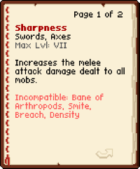
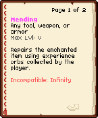
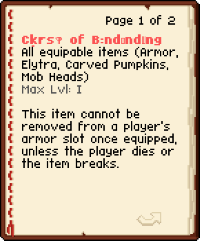
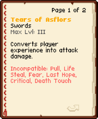
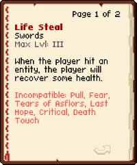
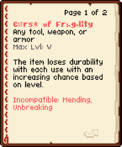

# Enchantment Lore Extended v 1.0

## About
**Enchantment Lore Extended** is a resource pack intended to be used with [Enchantment Lore](https://modrinth.com/mod/enchantment-lore), which allows the player to "read" enchanted books as if they're actual books.

This pack adds descriptions and flavor text for the enchantments in the mod/datapack [BeyondEnchant](https://modrinth.com/datapack/beyondenchant) and [Neo Enchant+](https://modrinth.com/datapack/neoenchant) made by [Hardel](https://modrinth.com/user/Hardel-DW). The lore is tied in with [Yggdrasil](https://modrinth.com/datapack/yggdrasil-structure) made by the same author.

This pack features formatted text showcasing a stylized title, applicable items, maximum level, a brief description, and any incompatibilities. Flavor text or lore is added at the end of each enchantment, viewable directly in-game.

## Preview
**BeyondEnchant** changes the maximum levels of vanilla enchantments.

**Neo Enchant+** adds completely new enchantments and curses.

Font used in the preview is [Compact Font](https://modrinth.com/resourcepack/compact-font) but it should be compatible with other font resource packs.

## Usage
### Requirements & Compatibility
This resource pack requires:
-   [Enchantment Lore](https://modrinth.com/mod/enchantment-lore)
-   [BeyondEnchant](https://modrinth.com/datapack/beyondenchant)
-   [Neo Enchant+](https://modrinth.com/datapack/neoenchant)

This resource pack should work with all supported versions of the specified mods above.

### Installation
1.  Download `Enchantment Lore Extended.zip`.
2.  Place the `.zip` file inside your Minecraft `resourcepacks` folder.
3.  In Minecraft, go to Options -> Resource Packs and enable the pack.
4.  **Important:** Make sure the "Enchantment Lore Extended" pack is placed **above** any other resource packs that might modify enchantment text to ensure it displays correctly.

## License & Attribution
The enchantment lore text in this resource pack is from the projects by [Hardel](https://modrinth.com/user/Hardel-DW). All credit for the original lore content goes to Hardel.

This lore content is distributed under the **Voxel License**, a copy of which is included in the `.zip` file and available [here](https://raw.githubusercontent.com/Hardel-DW/NeoEnchant/refs/heads/main/LICENSE).

**Modpack Creators:** You are welcome to include **Enchantment Lore Extended** in your modpacks. Please ensure a link back to this Modrinth page and proper credit are provided.

## Feedback
If you find any misspellings, errors, or corrections, please report them on the [GitHub Issues page](https://github.com/mult1v4c/Enchantment-Lore-Extended/issues). Any feedback and suggestions are always welcome.

## Support
If you appreciate the effort put into this pack, please consider supporting me on [Ko-fi](https://ko-fi.com/mult1v4c). Your support is greatly appreciated!